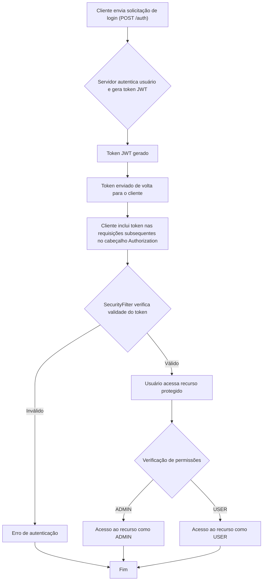
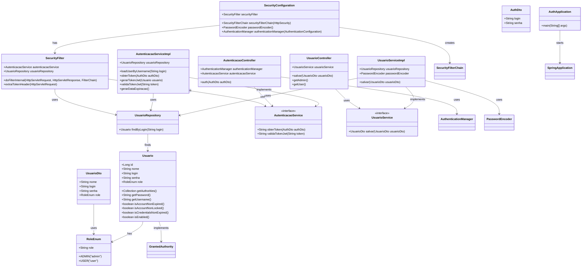

## API de Autenticação 🔐

### Descrição 
Esta API tem como objetivo fornecer um sistema de autenticação e autorização baseado em JWT (JSON Web Token), permitindo que usuários se autentiquem, obtenham tokens de acesso e acessem recursos protegidos com base em suas permissões (admin ou user).

### Tecnologias Utilizadas 🛠️:
- Spring Boot 🚀
- Spring Security 🔒
- JPA (Hibernate) 📚
- JWT (JSON Web Token) 🏷️
- Banco de Dados H2 (para desenvolvimento) 🗄️

### Funcionalidades 📋:
1. **Autenticação de Usuários**: Endpoint para autenticar usuários e retornar um token JWT.
2. **Gerenciamento de Usuários**: Endpoint para cadastro de novos usuários.
3. **Autorização Baseada em Função**: Controle de acesso de acordo com o papel do usuário (admin ou user).

### Endpoints da API 📡

#### 1. `/auth` - Autenticação 🔑
- **Método HTTP**: `POST`
- **Descrição**: Realiza a autenticação de um usuário e retorna um token JWT.
- **Request Body**:
    ```json
    {
        "login": "usuario",
        "senha": "senha"
    }
    ```
- **Resposta**:
    - **Status**: `200 OK`
    - **Body**: Token JWT (Exemplo):
      ```json
      {
        "token": "eyJhbGciOiJIUzI1NiIsInR5cCI6IkpXVCJ9..."
      }
      ```

#### 2. `/usuarios` - Cadastro de Usuário 🧑‍💻
- **Método HTTP**: `POST`
- **Descrição**: Registra um novo usuário no sistema.
- **Request Body**:
    ```json
    {
        "nome": "Nome do Usuário",
        "login": "usuario123",
        "senha": "senha123",
        "role": "USER"
    }
    ```
- **Resposta**:
    - **Status**: `200 OK`
    - **Body**:
      ```json
      {
        "nome": "Nome do Usuário",
        "login": "usuario123",
        "senha": "Senha codificada",
        "role": "USER"
      }
      ```

#### 3. `/usuarios/admin` - Endpoint protegido para Admin 👑
- **Método HTTP**: `GET`
- **Descrição**: Acesso restrito a usuários com o papel de "ADMIN".
- **Resposta**:
    - **Status**: `200 OK`
    - **Body**:
      ```json
      "permissão de administrador"
      ```

#### 4. `/usuarios/user` - Endpoint protegido para User 🧑‍🤝‍🧑
- **Método HTTP**: `GET`
- **Descrição**: Acesso restrito a usuários com o papel de "USER".
- **Resposta**:
    - **Status**: `200 OK`
    - **Body**:
      ```json
      "permissão de usuário"
      ```

### Autorização 🚫

A API utiliza o **Spring Security** para controlar o acesso aos endpoints, com base no papel do usuário (admin ou user). As permissões são configuradas da seguinte forma:

- **Admin**: Tem acesso a todos os endpoints.
- **User**: Tem acesso apenas a endpoints específicos (por exemplo, `/usuarios/user`).

### Fluxo de Autenticação 🔄

1. O usuário faz uma requisição para o endpoint `/auth` com suas credenciais (login e senha).
2. O sistema valida as credenciais e gera um token JWT.
3. O token é retornado para o cliente, que deve incluí-lo no cabeçalho das próximas requisições.
4. O filtro de segurança (`SecurityFilter`) intercepta as requisições e valida o token JWT.
5. Com o token validado, o usuário pode acessar os recursos protegidos de acordo com suas permissões.

### Segurança 🔐

- **JWT (JSON Web Token)** é usado para autenticação e autorização.
- **Bearer Token**: O token JWT deve ser enviado no cabeçalho `Authorization` nas requisições subsequentes no formato `Bearer <token>`.

### Configuração de Segurança ⚙️

A configuração de segurança está definida na classe `SecurityConfiguration`, que define as permissões para cada endpoint da API:

- **Endpoints públicos**: `/auth`, `/auth/refresh-token`, `/usuarios` (POST) são acessíveis sem autenticação.
- **Endpoints protegidos**: `/usuarios/admin` e `/usuarios/user` são restritos a usuários com as permissões apropriadas (roles "ADMIN" e "USER").

### Estrutura de Dados 📊

#### 1. **AuthDto**: Dados necessários para a autenticação do usuário.
```java
public record AuthDto(String login, String senha) {}
```

#### 2. **UsuarioDto**: Dados para criar ou representar um usuário no sistema.
```java
public record UsuarioDto(String nome, String login, String senha, RoleEnum role) {}
```

#### 3. **RoleEnum**: Enum para definir os papéis do usuário.
```java
public enum RoleEnum {
    ADMIN("admin"),
    USER("user");

    private String role;
    private RoleEnum(String role) {
        this.role = role;
    }
}
```

#### 4. **Usuario**: Entidade que representa o usuário no banco de dados.
```java
@Entity
@Table(name = "TB_USUARIO")
public class Usuario implements UserDetails {
    // Campos: id, nome, login, senha, role
    @Override
    public Collection<? extends GrantedAuthority> getAuthorities() {
        if(this.role == RoleEnum.ADMIN) {
            return List.of(new SimpleGrantedAuthority("ROLE_ADMIN"), new SimpleGrantedAuthority("ROLE_USER"));
        }
        return List.of(new SimpleGrantedAuthority("ROLE_USER"));
    }
    // Outros métodos do UserDetails
}
```

### Como Funciona o Fluxo de Autenticação 🔄:



### Banco de Dados 🗄️
A API utiliza o banco de dados H2 para armazenar usuários. Os usuários são persistidos na tabela `TB_USUARIO`, e seus dados incluem: `id`, `nome`, `login`, `senha`, e `role`.

### Diagrama de classes:

